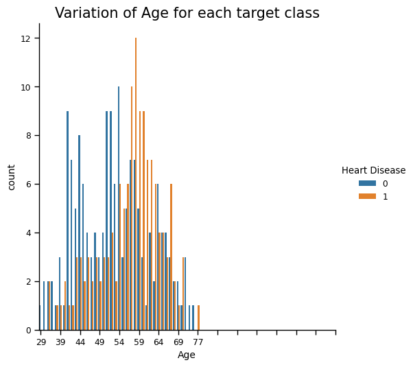

# ML-Stacking-Heart-Disease
## _Prediction of the risk of heart disease_

Nowadays, the number of heart-related diseases is steadily increasing regardless of gender or age. According to data from the World Health Organization (WHO), heart disease is the leading cause of death worldwide. Ischemic heart disease accounts for 16% and stroke for 11% of total global deaths. Since 2000, deaths from heart disease have seen the greatest increase, rising by over 2 million to 8.9 million in 2019. Common heart conditions include blood vessel diseases such as coronary artery disease, heart rhythm problems (arrhythmias), congenital heart defects, and various other cardiovascular disorders.  

Therefore, early prediction of cardiovascular diseases is considered one of the critical tasks in clinical data analysis. In this project, we apply basic machine learning techniques to predict whether a person is at risk of heart disease based on the Cleveland Heart Disease dataset from the UCI Machine Learning Repository. The data was preprocessed by filling missing values (NaN) and applying normalization before training.

## Feature  
- Naive Bayes
- K Nearest Neightbors (KNN)
- Support Vector Machine (SVM)
- Decision Tree
- Random Forest
- Adaboost
- Gradient Boost
- XGBoost
- Stacking

> These algorithms are implemented
> using the scikit-learn library,
> after I had gained a solid understanding of
> the fundamental concepts behind each method.

## Result
The table below shows a comparison of the accuracy scores of different algorithms on both the training and test sets.
| Algorithm | Accuracy for train set | Accuracy for test set |
| ------ | ------ | ------ |
| KNN | 0.88 | 0. 84 |
| SVM | 0.91 | 0.84 |
| Naive Bayes | 0.87 | 0.79 |
| Decision Tree | 1.0 | 0.77 |
| Random Forest | 0.99 | 0.8 |
| Adaboost | 0.91 | 0.79 |
| Gradient Boost | 1.0 | 0.77 |
| XGBoost | 1.0 | 0.79 |
| Stacking | 0.96 | 0.84 |

## 